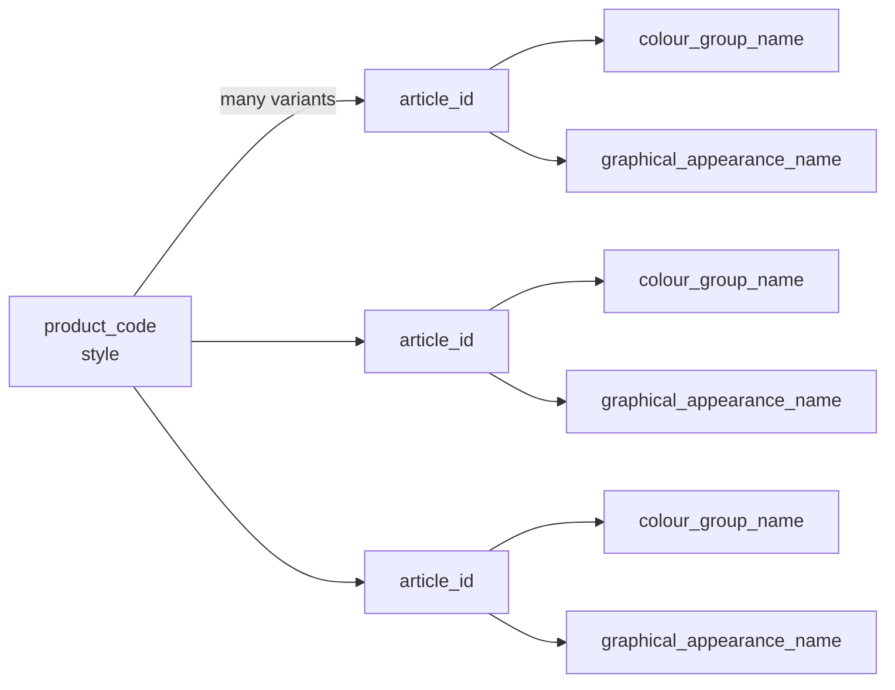
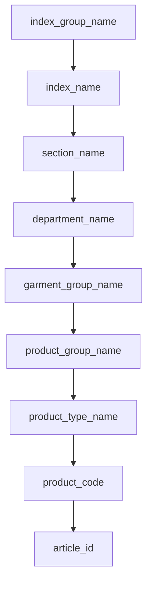
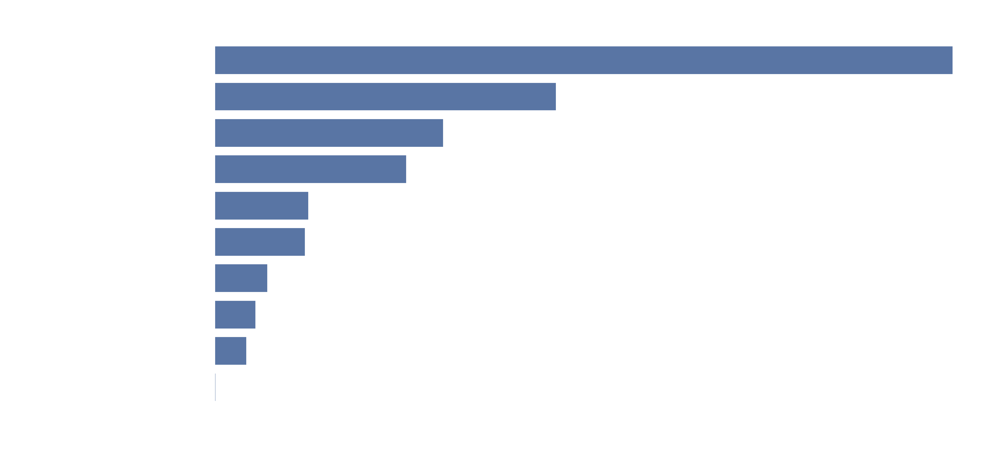
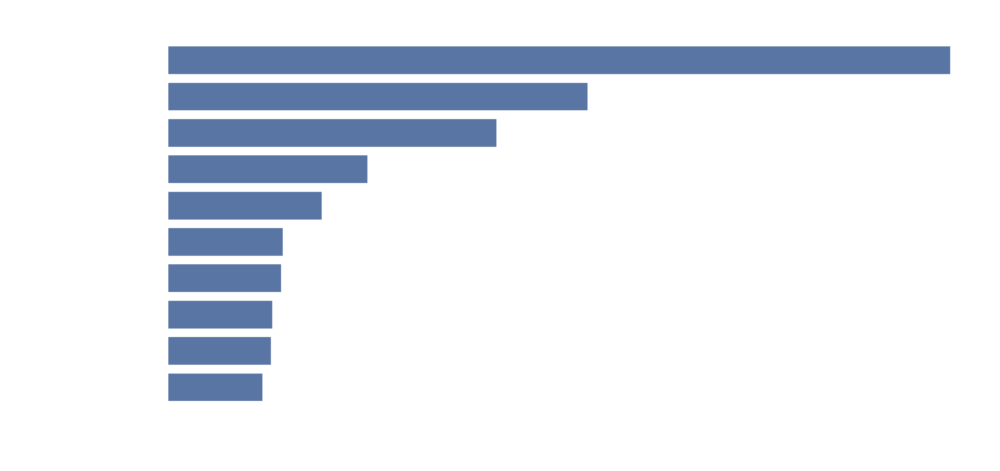
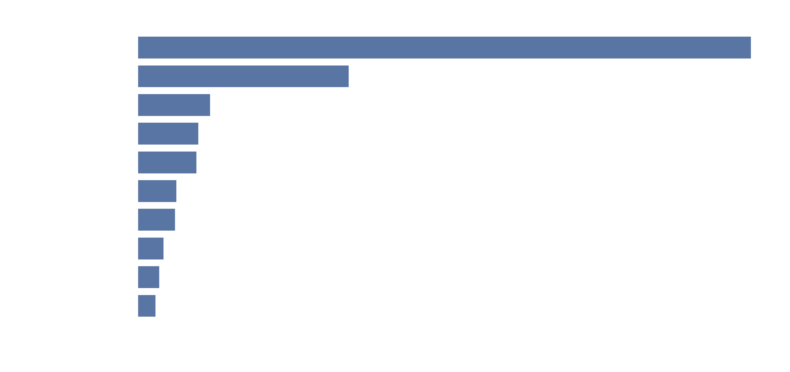
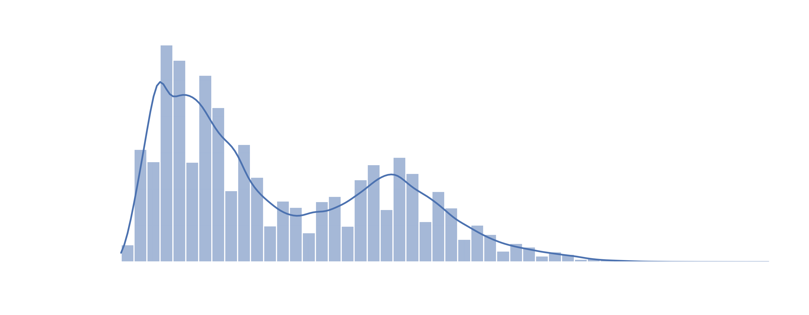
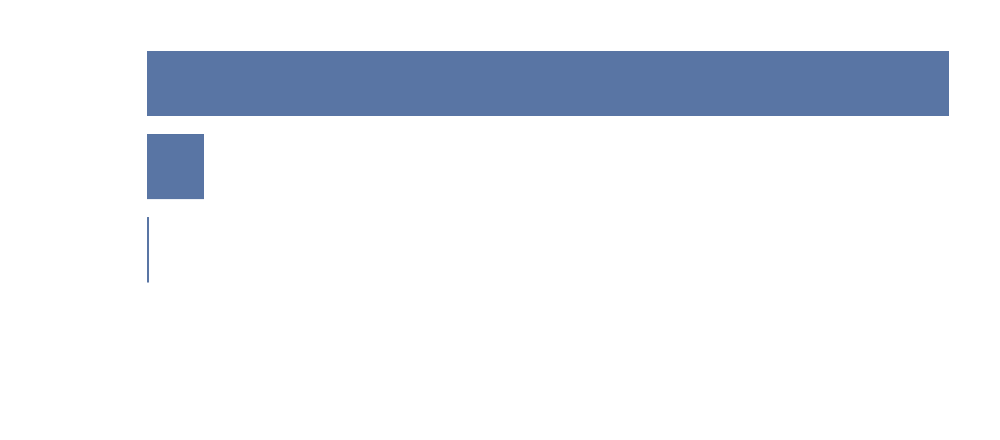
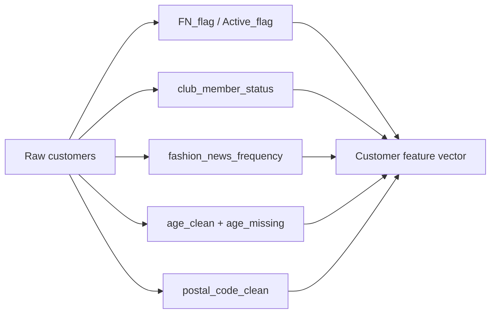

slidenumbers: true
autoscale: true
build-lists: true

# H&M Dataset

## EDA highlights and modeling implications

---

# Part I

## Articles

---

# Why this table matters

This is the **item catalog** for the H&M recommendations problem:

-   **SKU-level** rows (article_id) with rich categorical metadata
-   Text field (**detail_desc**) for semantic signals
-   Multiple “code + name” pairs that must stay consistent

^ The rest of the pipeline (customers + transactions) learns preferences; this table is how we describe items to the model.
^ The recommender ultimately predicts relationships between customers and article_id. This table supplies the descriptors that make similarity and explainability possible.

---

# Articles at a glance

| Metric               |               Value |
| -------------------- | ------------------: |
| Rows                 |             105,542 |
| Columns              |                  25 |
| Dtypes               | 11 int64, 14 object |
| Duplicate article_id |                   0 |
| Missing detail_desc  |         416 (0.39%) |

All in all: dense catalog, very clean, plus a tiny text-missing pocket.

^ Clean catalog is great news: no duplicate keys, minimal missingness. The only gap is a small fraction of missing descriptions, which we can safely fill while keeping a “missing_desc” indicator if needed.

---

# Schema (a bit hard)

**Identifiers**

-   `article_id` (SKU identifier)
-   `product_code` (style identifier grouping multiple variants)

**Naming & taxonomy**

-   Product: `prod_name`, `product_type_*`, `product_group_name`
-   Visuals: `graphical_appearance_*`, `colour_group_*`, `perceived_colour_*`
-   Merch hierarchy: `department_*`, `section_*`, `index_*`, `index_group_*`, `garment_group_*`
-   Text: `detail_desc`

^ Why it feels “redundant”: many fields repeat the same concept at different levels. That redundancy is useful, because it gives the model multiple resolution levels: broad category, mid-level department, and fine-grain type.

---

# Variant structure (style → SKUs)



^ What we’re seeing: product_code is a “style family” and article_id are the purchasable variants (color/pattern differences are common).
^ Why it matters: similarity should often start at product_code (style) but final recommendations must be at article_id (the SKU people actually buy).
^ Modeling implication: build features at both levels. product_code groups for general similarity; article_id captures the specific option presented to the customer.

---

# Merch taxonomy stack (where labels come from)



^ What we’re seeing: labels are layered. Higher levels are marketing/merch buckets, lower levels are product structure.
^ Why it matters: this hierarchy is a built-in prior. Items near each other in this tree are more likely substitutable. Cross-level links also help when a fine label is missing or too sparse.

---

# Articles: top product groups



^ Product groups show how the catalog is distributed at a high level: a few groups dominate and the rest form a long tail.
^ Interpretation: the recommendation system will naturally be pulled toward these dominant groups if we don’t control for popularity bias.
^ Modeling note: product_group is a strong, stable categorical feature for items, but it can also “collapse” diversity. We need to make sure the model doesn’t default to the biggest groups for everyone. Good practice would be to use it as part of an embedding-based feature set, then add diversification constraints or re-ranking.

---

# Articles: top colors



^ What we’re seeing: Black is the top color by a wide margin, followed by Dark Blue and White, then a long tail.
^ Why it happens: dark neutrals are used across many product lines and seasons, so they appear in most style families.
^ Why it matters for modeling: color can become a shortcut. Similarity search tends to latch onto “black + solid” items unless you balance or diversify. Color is still high-signal, but it needs guardrails so niche color preferences can surface.

---

# Graphical appearances



^ What we’re seeing: Solid dominates, and then we get patterns and textures like stripe, melange, all-over pattern, denim effects.
^ Why it matters: this feature is closer to “style” than the taxonomy fields. It’s useful for capturing taste, not just category membership.
^ Modeling note: encode graphical_appearance with embeddings rather than one-hot if you use neural models. It also boosts interpretability: “recommended because you often buy solid tops” is a human-readable explanation.

---

# Part II

## Customers (profiles and signals)

^ This section continues the EDA, now focused on the customer-level table.
^ Key theme: most columns are categorical or semi-observed flags, not rich behavioral data.
^ Mental model: customers.csv is a profile table. It is not behavior. The behavior comes from transactions; customers.csv provides context and segmentation signals.

---

# Customers dataset snapshot

| Metric                |     Value |
| --------------------- | --------: |
| Rows                  | 1,371,980 |
| Columns               |         7 |
| Duplicate customer_id |         0 |

Columns:
`customer_id, FN, Active, club_member_status, fashion_news_frequency, age, postal_code`

^ This table is intentionally lightweight: demographics, marketing state, and location proxy. That’s typical for privacy-preserving recommendation datasets.

---

# Columns

-   `customer_id`: anonymized unique user key (join key to transactions)
-   `FN`: **semi-observed flag** (1.0 or NaN)
-   `Active`: **semi-observed flag** (1.0 or NaN)
-   `club_member_status`: membership lifecycle state (ACTIVE, PRE-CREATE, LEFT CLUB, missing)
-   `fashion_news_frequency`: newsletter frequency preference (NONE, Regularly, Monthly, missing)
-   `age`: numeric demographic feature (mostly present)
-   `postal_code`: anonymized location proxy, very high-cardinality

^ “Semi-observed” means presence has meaning, absence also has meaning.
^ What “flag” means here: the field only stores 1 when a condition is true. The absence (NaN) implicitly means “not flagged”.
^ What FN likely represents: a binary CRM attribute related to fashion news/marketing or internal segmentation. In this dataset it behaves like a sparse indicator, not a measured quantity.

---

# Missingness is the story here

Non-zero missingness:

-   **FN missing: 65.24%**
-   **Active missing: 66.15%**
-   `fashion_news_frequency` missing: 1.17%
-   `age` missing: 1.16%
-   `club_member_status` missing: 0.44%

-   FN/Active are not “broken data”, they encode a sparse flag system.

^ What we’re seeing: the only big missingness is in FN and Active, and it’s systematic.
^ Why it matters: treating NaN as “unknown” would make the model think we have incomplete data. Here, NaN is usually the negative case (flag not set). So we convert them to binary features.

---

# Customers: age distribution



^ Mean 36.4, median 32, heavy mass in 19–49, thin tail up to 99.

---

# Customers: club status



^ What we’re seeing: the customer base is overwhelmingly ACTIVE (~92.7%), with a meaningful PRE-CREATE segment (~6.8%) and a tiny LEFT CLUB tail (~0.03%).
^ Interpretation: this table is not “engagement behavior”, it’s mostly lifecycle metadata. ACTIVE is basically the default state, so it won’t separate customers much on its own.
^ Modeling note: keep PRE-CREATE as its own category because it likely captures onboarding or incomplete profiles and may correlate with weak/no transactions. LEFT CLUB is too small to learn reliably, so consider merging it into an INACTIVE bucket for modeling, but keep it separate for reporting.

---

# Customers: news frequency


^ Key split: NONE dominates (~64%), Regularly is a large minority (~35%), Monthly is negligible (~0.06%), plus a small missing pocket (~1.17%).
^ Interpretation: marketing preference is effectively binary: opted-in vs opted-out. Monthly is so rare it’s mostly noise.
^ Modeling note: you can collapse this to {NONE, Regularly, UNKNOWN} or even {opt_in, opt_out} depending on the model. This feature becomes more valuable when combined with transactions because opt-in often correlates with higher activity and retention, but we validate that by join, not assumption.

---

# Customers: sparse flags


^ Critical quirk: FN and Active are semi-observed flags. They only take value 1 when set, otherwise they’re missing. That means missing is not “unknown data quality”, it’s effectively “flag not set”.
^ From the EDA: FN_flag is 1 for ~34.8% of customers, Active_flag is 1 for ~33.8%, and the rest are 0 (previously NaN).
^ Modeling note: convert them to true binary variables (present→1, missing→0), and do not treat them as continuous numeric fields. These flags are likely to be high-signal when joined to transactions, because they’re often produced by internal CRM segmentation.

^ What we’re seeing: FN and Active behave as sparse flags. When the flag exists, it is always “1”; otherwise it is missing. So the chart is basically “share flagged” vs “share not flagged”.
^ What FN is: a customer-level binary attribute from H&M’s internal CRM segmentation. In this dataset it is not a count or score; it’s an indicator that a condition is true.
^ What Active is: another CRM-like indicator, typically representing whether the customer is considered active by internal criteria. Again, stored as a sparse flag.
^ Why this design exists: sparse indicators are common in operational databases. Storing only positives saves space and simplifies upstream logic.
^ Modeling implications: convert these into explicit binary variables (present→1, missing→0). Also consider validating what “Active” means by comparing it to transaction recency once transactions are joined.

---

# FN and Active are not numeric variables

Cardinality check:

-   `FN` nunique: **1**
-   `Active` nunique: **1**

-   when present, the value is always `1.0`
-   everything else is `NaN`

So we treat them as **binary flags**.

```python
df["FN_flag"] = (df["FN"] == 1).fillna(False).astype(int)
df["Active_flag"] = (df["Active"] == 1).fillna(False).astype(int)
```

^ Why we do this: we don’t want the model to interpret NaN as missing data quality. We want it to interpret it as the negative case.
^ Extra guard: keep the original columns only for auditability, but use the flags in downstream modeling and plots.

---

# Customers: feature blueprint



^ What we’re seeing: customer features are a mix of segmentation (status, opt-in), demographics (age), and location proxy (postal_code).
^ Why it matters: customers.csv alone cannot learn taste. It improves recommendations by conditioning the behavior model: cold start, cohort effects, and better ranking priors.
^ Next step: join transactions and test hypotheses. Example: do Active_flag customers purchase more recently? do FN_flag customers have broader category coverage?

---

Made by:

Alena Zabrodskaya
Ekaterina Bakay
Ilya Malakhov
